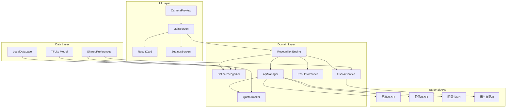
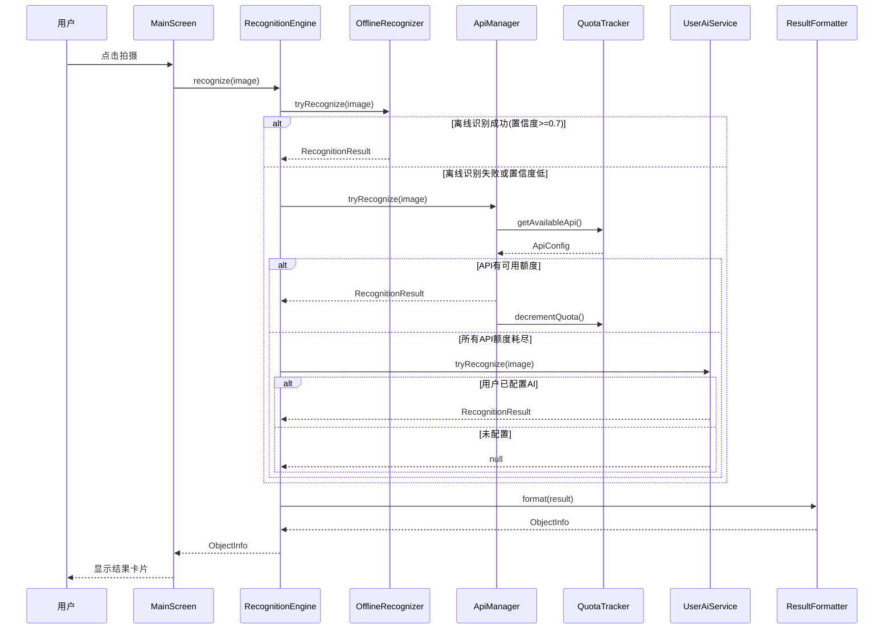

# Design Document

## Overview

本设计文档描述了 **若里见真** Android原生物品识别应用的技术架构。应用采用三层识别策略（离线优先→免费API→用户AI），实现对用户完全透明的智能切换机制，确保丝滑的用户体验。

核心设计原则：
- **离线优先**：使用TensorFlow Lite + MobileNet实现本地识别
- **无感切换**：所有识别方式切换对用户透明
- **额度均衡**：多个免费API自动轮换，最大化利用免费资源
- **统一展示**：不同来源的结果格式化为统一样式

## Architecture



### 识别流程



## Components and Interfaces

### 1. RecognitionEngine（识别引擎）

核心调度组件，负责协调所有识别方式。

```kotlin
interface RecognitionEngine {
    /**
     * 识别图片中的物品
     * @param bitmap 待识别的图片
     * @return 识别结果，包含物品信息
     */
    suspend fun recognize(bitmap: Bitmap): Result<ObjectInfo>
    
    /**
     * 获取当前识别状态
     */
    fun getRecognitionState(): StateFlow<RecognitionState>
}

sealed class RecognitionState {
    object Idle : RecognitionState()
    object Processing : RecognitionState()
    data class Success(val info: ObjectInfo) : RecognitionState()
    data class Error(val message: String) : RecognitionState()
}
```

### 2. OfflineRecognizer（离线识别器）

基于TensorFlow Lite的本地识别模块。

```kotlin
interface OfflineRecognizer {
    /**
     * 本地识别物品
     * @param bitmap 待识别图片
     * @return 识别结果，包含置信度
     */
    suspend fun recognize(bitmap: Bitmap): OfflineResult?
    
    /**
     * 获取内置物品详细信息
     * @param label 识别标签
     * @return 物品详细信息
     */
    fun getObjectDetails(label: String): ObjectDetails?
}

data class OfflineResult(
    val label: String,
    val confidence: Float,
    val details: ObjectDetails?
)

data class ObjectDetails(
    val name: String,
    val aliases: List<String>,
    val origin: String,
    val usage: String,
    val category: String
)
```

### 3. ApiManager（API管理器）

管理多个免费API的调用和切换。

```kotlin
interface ApiManager {
    /**
     * 使用在线API识别
     * 自动选择可用API，额度耗尽自动切换
     */
    suspend fun recognize(bitmap: Bitmap): ApiResult?
    
    /**
     * 获取所有API状态
     */
    fun getApiStatus(): List<ApiStatus>
}

data class ApiStatus(
    val name: String,
    val remainingQuota: Int,
    val resetTime: Long,
    val isAvailable: Boolean
)

data class ApiResult(
    val name: String,
    val description: String,
    val confidence: Float,
    val source: String
)
```

### 4. QuotaTracker（额度追踪器）

持久化管理API额度。

```kotlin
interface QuotaTracker {
    /**
     * 获取下一个可用的API配置
     */
    fun getNextAvailableApi(): ApiConfig?
    
    /**
     * 减少指定API的额度
     */
    fun decrementQuota(apiName: String)
    
    /**
     * 检查并重置过期的额度
     */
    fun checkAndResetQuotas()
    
    /**
     * 获取所有API的额度状态
     */
    fun getAllQuotaStatus(): List<QuotaStatus>
}

data class ApiConfig(
    val name: String,
    val baseUrl: String,
    val apiKey: String,
    val dailyLimit: Int,
    val monthlyLimit: Int
)

data class QuotaStatus(
    val apiName: String,
    val dailyUsed: Int,
    val dailyLimit: Int,
    val monthlyUsed: Int,
    val monthlyLimit: Int,
    val lastResetDate: Long
)
```

### 5. UserAiService（用户AI服务）

管理用户自配置的AI服务，仅支持Google Gemini和OpenAI兼容格式的API。

```kotlin
interface UserAiService {
    /**
     * 使用用户配置的AI识别
     */
    suspend fun recognize(bitmap: Bitmap): AiResult?
    
    /**
     * 检查用户是否已配置AI
     */
    fun isConfigured(): Boolean
    
    /**
     * 保存用户AI配置
     */
    fun saveConfig(config: UserAiConfig): Boolean
    
    /**
     * 验证配置有效性
     */
    suspend fun validateConfig(config: UserAiConfig): Boolean
}

/**
 * 用户AI配置
 * 仅支持两种API格式：Google Gemini 和 OpenAI兼容格式
 */
data class UserAiConfig(
    val apiType: AiApiType,            // API类型
    val apiUrl: String,                // API地址（OpenAI兼容格式可自定义）
    val apiKey: String,                // API密钥
    val modelName: String              // 模型名称
)

enum class AiApiType {
    GOOGLE_GEMINI,    // Google Gemini API (gemini-pro-vision等)
    OPENAI_COMPATIBLE // OpenAI兼容格式 (支持OpenAI、通义千问、DeepSeek等)
}
```

### 6. ResultFormatter（结果格式化器）

将不同来源的结果统一为标准格式。

```kotlin
interface ResultFormatter {
    /**
     * 格式化离线识别结果
     */
    fun format(result: OfflineResult): ObjectInfo
    
    /**
     * 格式化API识别结果
     */
    fun format(result: ApiResult): ObjectInfo
    
    /**
     * 格式化用户AI识别结果
     */
    fun format(result: AiResult): ObjectInfo
}
```

## Data Models

### ObjectInfo（统一物品信息）

所有识别结果的统一展示格式。

```kotlin
data class ObjectInfo(
    val id: String,                    // 唯一标识
    val name: String,                  // 物品名称
    val aliases: List<String>,         // 别名列表
    val origin: String,                // 来历/起源
    val usage: String,                 // 用途说明
    val category: String,              // 分类标签
    val confidence: Float,             // 识别置信度
    val source: RecognitionSource,     // 识别来源
    val imageUrl: String?,             // 参考图片URL
    val additionalInfo: Map<String, String> // 额外信息
)

enum class RecognitionSource {
    OFFLINE,      // 离线识别
    BAIDU_API,    // 百度AI
    TENCENT_API,  // 腾讯AI
    ALIYUN_API,   // 阿里云
    USER_AI       // 用户自配AI
}
```

### 内置物品数据库Schema

```kotlin
@Entity(tableName = "objects")
data class ObjectEntity(
    @PrimaryKey val label: String,     // MobileNet标签
    val nameCn: String,                // 中文名称
    val nameEn: String,                // 英文名称
    val aliases: String,               // 别名(JSON数组)
    val origin: String,                // 来历描述
    val usage: String,                 // 用途说明
    val category: String,              // 分类
    val imageAsset: String?            // 内置图片资源名
)
```

### API额度存储

```kotlin
@Entity(tableName = "api_quotas")
data class ApiQuotaEntity(
    @PrimaryKey val apiName: String,
    val dailyUsed: Int,
    val dailyLimit: Int,
    val monthlyUsed: Int,
    val monthlyLimit: Int,
    val lastDailyReset: Long,
    val lastMonthlyReset: Long
)
```

## Correctness Properties

*A property is a characteristic or behavior that should hold true across all valid executions of a system-essentially, a formal statement about what the system should do. Properties serve as the bridge between human-readable specifications and machine-verifiable correctness guarantees.*


### Property 1: 识别优先级保证

*For any* 识别请求，RecognitionEngine必须首先调用OfflineRecognizer；只有当离线识别置信度低于阈值时，才会调用ApiManager。

**Validates: Requirements 2.1, 2.2**

### Property 2: API额度切换正确性

*For any* API调用场景，当当前API额度耗尽或调用失败时，ApiManager必须自动切换到下一个可用API，且切换过程不中断识别流程。

**Validates: Requirements 3.2, 3.3**

### Property 3: 降级策略完整性

*For any* 识别请求，当所有免费API额度耗尽且用户已配置UserAiConfig时，RecognitionEngine必须调用用户配置的AI服务。

**Validates: Requirements 2.4**

### Property 4: 额度持久化round-trip

*For any* QuotaStatus对象，保存到持久化存储后再读取，应该得到等价的对象。

**Validates: Requirements 3.1**

### Property 5: 额度重置正确性

*For any* API额度记录，当新的计费周期开始（日/月）时，对应的已用额度必须重置为0。

**Validates: Requirements 3.4**

### Property 6: 结果格式化完整性

*For any* 识别结果（无论来源），经过ResultFormatter格式化后的ObjectInfo必须包含所有必需字段（名称、别名列表、来历描述、用途说明、分类标签），且缺失字段使用默认占位符而非空值。

**Validates: Requirements 4.1, 4.2, 4.3**

### Property 7: 用户配置持久化round-trip

*For any* UserAiConfig对象，保存后再读取应该得到等价的配置。

**Validates: Requirements 5.3**

### Property 8: 离线识别数据完整性

*For any* 成功的离线识别结果，返回的ObjectDetails必须包含完整的物品信息（名称、别名、来历、用途）。

**Validates: Requirements 6.2**

## Error Handling

### 识别层错误处理

| 错误场景 | 处理策略 |
|---------|---------|
| 离线识别失败 | 静默切换到API识别 |
| 单个API调用失败 | 自动切换下一个API |
| 所有API额度耗尽 | 尝试用户AI，若未配置则提示 |
| 用户AI调用失败 | 显示"无法识别"友好提示 |
| 网络超时 | 3秒超时后自动切换下一个API |

### 权限错误处理

| 错误场景 | 处理策略 |
|---------|---------|
| 摄像头权限被拒绝 | 显示引导对话框，提供跳转设置选项 |
| 存储权限被拒绝 | 降级运行，不保存识别历史 |

### 数据错误处理

| 错误场景 | 处理策略 |
|---------|---------|
| 本地数据库损坏 | 重新初始化数据库 |
| 配置文件损坏 | 重置为默认配置 |
| API返回格式异常 | 使用默认占位符填充缺失字段 |

## Testing Strategy

### 单元测试

使用JUnit5 + MockK进行单元测试：

- **RecognitionEngine测试**：验证识别优先级和切换逻辑
- **QuotaTracker测试**：验证额度计算和重置逻辑
- **ResultFormatter测试**：验证格式化输出的完整性
- **ApiManager测试**：验证API选择和切换逻辑

### 属性测试

使用Kotest的Property-Based Testing：

- 每个属性测试运行最少100次迭代
- 使用Arbitrary生成随机测试数据
- 测试标注格式：**Feature: object-recognition-app, Property N: {property_text}**

### 集成测试

- 摄像头集成测试（使用Android Instrumented Tests）
- API集成测试（使用MockWebServer模拟API响应）
- 数据库集成测试（使用Room的in-memory数据库）

### 测试框架选择

| 测试类型 | 框架 |
|---------|------|
| 单元测试 | JUnit5 + MockK |
| 属性测试 | Kotest Property Testing |
| UI测试 | Espresso |
| 集成测试 | AndroidX Test |

## 技术选型

### 离线识别

- **TensorFlow Lite** - 轻量级ML推理框架
- **MobileNet V2** - 预训练图像分类模型，支持1000+类别
- **Room Database** - 内置物品信息存储

### 在线API（免费额度）

| API服务 | 免费额度 | 特点 |
|--------|---------|------|
| 百度AI图像识别 | 每日500次 | 通用物体识别，中文支持好 |
| 腾讯云图像识别 | 每月1000次 | 场景识别准确 |
| 阿里云图像识别 | 每日500次 | 商品识别强 |

### 用户自配AI（仅支持两种格式）

| API格式 | 说明 | 示例服务 |
|--------|------|---------|
| Google Gemini | Google官方Gemini API | gemini-pro-vision |
| OpenAI兼容 | 遵循OpenAI API格式的服务 | OpenAI、通义千问、DeepSeek、Ollama等 |

### Android技术栈

- **Kotlin** - 主要开发语言
- **Jetpack Compose** - 现代UI框架，Material Design 3
- **CameraX** - 摄像头API，确保跨设备兼容性
- **Hilt** - 依赖注入
- **Coroutines + Flow** - 异步处理
- **DataStore** - 配置存储

### 兼容性设计

| 兼容项 | 方案 |
|-------|------|
| Android版本 | 最低支持Android 8.0 (API 26) |
| 摄像头兼容 | 使用CameraX统一API，自动适配不同厂商 |
| 屏幕适配 | 使用Compose响应式布局，支持手机/平板 |
| 异形屏 | 使用WindowInsets API适配刘海屏/挖孔屏/折叠屏 |
| 品牌权限 | 封装权限请求，处理各品牌差异（华为、小米等） |

### UI/UX设计原则

- **Material Design 3** - 采用最新设计语言
- **单手操作** - 主要操作区域在屏幕下半部分
- **流畅动画** - 过渡动画控制在300ms以内
- **即时反馈** - 所有操作都有视觉反馈
- **深色模式** - 跟随系统或手动切换
