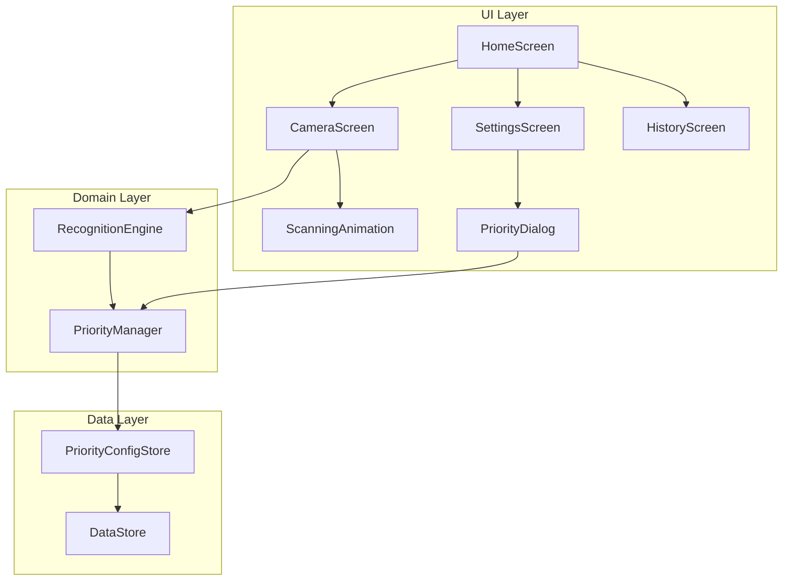
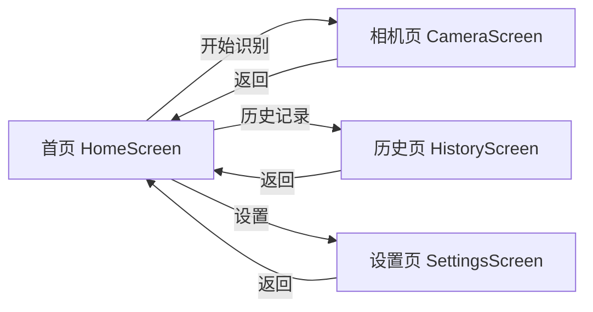
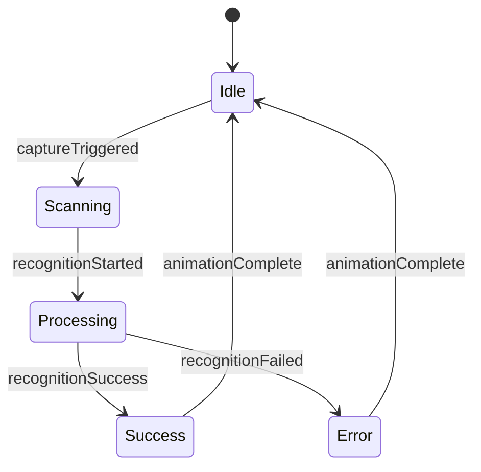

# Design Document: Home Screen, Scanning Animation & Recognition Priority

## Overview

本设计文档描述了"若里见真"应用的三个新功能：
1. **首页面** - 大气简洁的应用入口，提供清晰的功能导航
2. **扫描动画效果** - 在识别过程中提供视觉反馈，提升用户体验
3. **识别优先级配置** - 允许用户自定义识别方式的执行顺序

## Architecture

### 系统架构图



### 导航流程



### 动画状态机



## Components and Interfaces

### 1. HomeScreen Component

```kotlin
/**
 * 首页面
 * 大气简洁的应用入口，提供功能导航
 */
@Composable
fun HomeScreen(
    onStartRecognition: () -> Unit,
    onNavigateToHistory: () -> Unit,
    onNavigateToSettings: () -> Unit
)
```

**UI布局设计：**

```
┌─────────────────────────────────────┐
│                                     │
│         [App Logo - 圆形]            │
│                                     │
│           若里见真                   │
│      智能识别，探索万物              │
│                                     │
│                                     │
│    ┌─────────────────────────┐      │
│    │                         │      │
│    │      📷 开始识别         │      │
│    │                         │      │
│    └─────────────────────────┘      │
│                                     │
│                                     │
│     ┌─────────┐   ┌─────────┐       │
│     │ 📜 历史  │   │ ⚙️ 设置  │       │
│     └─────────┘   └─────────┘       │
│                                     │
└─────────────────────────────────────┘
```

**设计特点：**
- 渐变背景：从浅蓝到白色的柔和渐变
- 大量留白：简洁大气
- 主按钮突出：大尺寸、圆角、阴影效果
- 次要入口：底部小卡片式设计
- 微动画：Logo轻微呼吸动画，按钮hover效果

### 2. ScanningAnimation Component

```kotlin
/**
 * 扫描动画状态
 */
sealed class ScanningAnimationState {
    object Idle : ScanningAnimationState()
    object Scanning : ScanningAnimationState()
    object Processing : ScanningAnimationState()
    object Success : ScanningAnimationState()
    object Error : ScanningAnimationState()
}

/**
 * 扫描动画组件
 * 提供脉冲圆环、扫描线、旋转边框等动画效果
 */
@Composable
fun ScanningAnimation(
    state: ScanningAnimationState,
    modifier: Modifier = Modifier
)
```

**动画效果设计：**

1. **Scanning状态** - 脉冲圆环
   - 从中心向外扩散的圆环
   - 透明度渐变消失
   - 循环播放

2. **Processing状态** - 扫描线 + 旋转边框
   - 水平扫描线从上到下移动
   - 四角旋转的渐变边框
   - 科技感光效

3. **Success状态** - 成功动画
   - 绿色对勾图标
   - 缩放弹出效果
   - 300ms后淡出

4. **Error状态** - 错误动画
   - 红色脉冲效果
   - 轻微震动
   - 快速淡出

### 3. PriorityManager Interface

```kotlin
/**
 * 识别方式枚举
 */
enum class RecognitionMethod(val displayName: String) {
    OFFLINE("本地识别"),
    BAIDU_API("百度API"),
    USER_AI("自定义AI")
}

/**
 * 识别方式配置项
 */
data class RecognitionMethodConfig(
    val method: RecognitionMethod,
    val enabled: Boolean = true,
    val priority: Int  // 0 = highest priority
)

/**
 * 优先级配置
 */
data class PriorityConfig(
    val methods: List<RecognitionMethodConfig>
) {
    companion object {
        val DEFAULT = PriorityConfig(
            methods = listOf(
                RecognitionMethodConfig(RecognitionMethod.OFFLINE, true, 0),
                RecognitionMethodConfig(RecognitionMethod.BAIDU_API, true, 1),
                RecognitionMethodConfig(RecognitionMethod.USER_AI, true, 2)
            )
        )
    }
}

/**
 * 优先级管理器接口
 */
interface PriorityManager {
    suspend fun getConfig(): PriorityConfig
    suspend fun saveConfig(config: PriorityConfig)
    fun getConfigFlow(): Flow<PriorityConfig>
    suspend fun getEnabledMethodsInOrder(): List<RecognitionMethod>
    suspend fun resetToDefault()
}
```

### 4. PriorityConfigStore

```kotlin
/**
 * 优先级配置存储
 * 使用DataStore持久化配置
 */
interface PriorityConfigStore {
    suspend fun save(config: PriorityConfig)
    suspend fun load(): PriorityConfig?
    fun observe(): Flow<PriorityConfig?>
    suspend fun clear()
}
```

### 5. PrioritySettingsDialog

```kotlin
/**
 * 优先级设置对话框
 * 支持拖拽排序和启用/禁用切换
 */
@Composable
fun PrioritySettingsDialog(
    currentConfig: PriorityConfig,
    onConfigChanged: (PriorityConfig) -> Unit,
    onDismiss: () -> Unit
)
```

**UI设计：**

```
┌─────────────────────────────────────┐
│  识别优先级设置                  ✕   │
├─────────────────────────────────────┤
│                                     │
│  拖拽调整顺序，优先使用排在前面的方式  │
│                                     │
│  ┌─────────────────────────────┐    │
│  │ ≡  1. 自定义AI        [✓]  │    │
│  └─────────────────────────────┘    │
│  ┌─────────────────────────────┐    │
│  │ ≡  2. 本地识别        [✓]  │    │
│  └─────────────────────────────┘    │
│  ┌─────────────────────────────┐    │
│  │ ≡  3. 百度API         [✓]  │    │
│  └─────────────────────────────┘    │
│                                     │
│  ┌──────────┐  ┌──────────────┐     │
│  │   取消   │  │   保存设置   │     │
│  └──────────┘  └──────────────┘     │
│                                     │
└─────────────────────────────────────┘
```

## Data Models

### PriorityConfig JSON Schema

```json
{
  "methods": [
    {
      "method": "USER_AI",
      "enabled": true,
      "priority": 0
    },
    {
      "method": "OFFLINE",
      "enabled": true,
      "priority": 1
    },
    {
      "method": "BAIDU_API",
      "enabled": true,
      "priority": 2
    }
  ]
}
```

## Correctness Properties

*A property is a characteristic or behavior that should hold true across all valid executions of a system.*

### Property 1: Priority Configuration Round-Trip

*For any* valid PriorityConfig (containing any order of methods and any combination of enabled/disabled states), saving the config via PriorityManager and then loading it should produce an equivalent configuration with the same order and enabled states.

**Validates: Requirements 2.4, 2.5, 3.2, 3.3**

### Property 2: Recognition Order Execution

*For any* PriorityConfig with at least one enabled method, the RecognitionEngine should attempt recognition methods in the configured priority order, and if a method fails or returns low confidence, it should fall back to the next enabled method in the list.

**Validates: Requirements 2.7, 2.8**

### Property 3: Disabled Method Skipping

*For any* PriorityConfig where a recognition method is disabled, the RecognitionEngine should skip that method during recognition, regardless of its position in the priority order.

**Validates: Requirements 2.10**

## Error Handling

### Navigation Errors

| Error Scenario | Handling Strategy |
|----------------|-------------------|
| Camera permission denied | 显示权限说明页面，引导用户授权 |
| Navigation failure | 显示Toast提示，保持当前页面 |

### Animation Errors

| Error Scenario | Handling Strategy |
|----------------|-------------------|
| Animation frame drop | 自动降级到简化动画 |
| Memory pressure | 取消动画，显示静态加载指示器 |
| State transition error | 重置到Idle状态 |

### Priority Configuration Errors

| Error Scenario | Handling Strategy |
|----------------|-------------------|
| Corrupted config data | 重置为默认配置，记录错误日志 |
| DataStore read failure | 使用默认配置，显示Toast提示 |
| All methods disabled | 阻止保存，提示至少启用一种方式 |

## Testing Strategy

### Unit Tests

1. **HomeScreen Navigation Tests**
   - 测试点击"开始识别"导航到相机页
   - 测试点击"历史记录"导航到历史页
   - 测试点击"设置"导航到设置页

2. **PriorityManager Tests**
   - 测试默认配置
   - 测试配置更新
   - 测试getEnabledMethodsInOrder排序

3. **RecognitionEngine Priority Tests**
   - 测试按优先级顺序执行
   - 测试跳过禁用方法
   - 测试回退逻辑

### Property-Based Tests

使用Kotest进行属性测试：

1. **Property 1**: 生成随机PriorityConfig，验证保存后加载得到等价配置
2. **Property 2**: 生成随机优先级顺序，模拟识别过程，验证执行顺序正确
3. **Property 3**: 生成随机禁用配置，验证禁用方法被跳过
